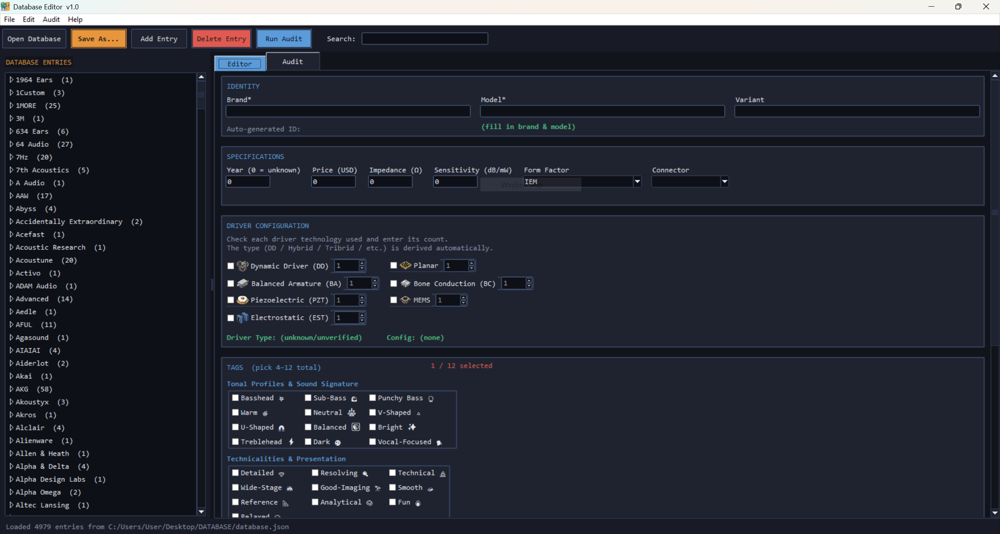

# Database Editor

A standalone desktop GUI for maintaining and auditing `database.json` — the catalog database used by **IEM Tool**.

Built entirely with Python and standard `tkinter`. It requires zero third-party packages to run and builds into a single, self-contained executable.

<p align="center">
  
</p>

---

## Features

### Smart Entry Form & Validation
- **Searchable tree view:** Entries are grouped by brand (`Brand (count) ▸ Model [Variant] — id`) with real-time text filtering.
- **Autofill suggestions:** Brand, Model, and Variant suggest existing values as you type.
- **Auto-generated IDs:** Normalizes Brand/Model/Variant (lowercase, underscores). Preserves `+` as `plus` (e.g., `Studio Buds+` → `studio_buds_plus`) to avoid ID collisions.
- **Input guardrails:**
  - Auto-rounds prices to the nearest $5 on focus lost.
  - Driver configuration builder computes `driver_type` and `driver_config` (e.g., `1DD+4BA+2EST`) automatically from selected driver counts.
  - Form Factor selection dynamically filters the Connector dropdown to prevent invalid pairings.
  - Tag selector enforces the 31 approved tags, blocks conflicting tonality tags, and assigns price-tier tags automatically.
- **Right-click menus:** Cut / Copy / Paste / Delete / Select All on every text field, including both search boxes. `Ctrl+A` works too.
- **Offline spellcheck:** Misspelled words in Brand/Model/Variant get a red underline; right-click offers corrections (`Anlysis` → Analysis). Every brand/model/variant already in the database is learned automatically, so product names are never flagged.
- **TWS lock:** Selecting Wireless Earbuds (TWS) zeroes and locks Impedance/Sensitivity — Bluetooth earbuds have no DAC/amp chain, so those numbers are meaningless. Loading an older entry that breaks this rule pops a warning and fixes it on save.
- **Icon dropdowns:** The Form Factor and Connector lists show their icons from `assets/icons/`.
- **Colored tag emojis:** Each tag shows a small colored emoji icon, sorted alphabetically inside its group.

### FR Curve Analysis
- **Suggest from FR Data:** Reads an entry's linked measurement `.txt` files, measures bass shelf, midrange, pinna gain, and treble against 1 kHz, and offers clickable tag suggestions. Multiple linked files vote together, so one odd measurement can't skew the result.

### Undo History & Backups
- **History tab:** Every edit, delete, and batch fix is logged in plain language (`Edited 'moondrop_chu_iii' — Price: $200 → $220`). Select any rows to undo or redo them.
- **Autosave backups:** Each change also writes a timestamped snapshot into a hidden `.db_editor_backups` folder next to `database.json` (last 15 kept). If the app ever crashes or closes unexpectedly, the next launch offers to restore it.

### Database Audit & Repair
- **Full database health check:** Scans on load (and on demand) for syntax errors, duplicate/malformed IDs, missing fields, invalid year formats, and tag rule violations.
- **File integrity checks:** Identifies missing measurement `.txt` files referenced in the JSON, unlinked `.txt` files in your `data/` directory, and paths whose spelling doesn't match disk (harmless on Windows, breaks on Linux).
- **Spec sanity:** Flags impedance/sensitivity values that aren't whole numbers or are negative, with one-click fixes.
- **One-click repairs:** Safely batch-fixes ID normalization, whitespace, price rounding, tier tags, spec values, and path casing in memory.
- **What it won't auto-fix:** Model/variant naming is intentionally left to manual review. Official names like "Koss Porta Pro" or "Simgot SuperMix 4" can't be safely pattern-matched, so renaming is handled by your LLM audit workflow instead.

### Safe File Handling
- **Non-destructive saving:** `Save As...` enforces saving to a new file and intentionally refuses to overwrite the loaded source file.
- **Strict schema export:** Formats JSON with 2-space indentation, sorting entries by `Brand → Model → Variant` with schema fields in fixed order.
- **Cross-platform paths:** Stores all measurement file references as forward-slash relative paths (`data/BRAND/file.txt`).

---

## Running from Source

Requires Python 3.8+. `tkinter` is included with standard Python installations on Windows and macOS. On Debian/Ubuntu Linux, install it via `sudo apt install python3-tk`.

```bash
python app/main.py
```

- If `database.json` and the `data/` directory are in the same folder as the script/executable, they load automatically.
- Use **File → Open Database...** or **File → Set Data Folder...** to point to custom locations.

---

## Building Executables

### Windows (`.exe`)
```bash
cd app
python -m pip install pyinstaller
python -m PyInstaller --onefile --windowed --name "Database Editor" --icon="assets/icon.ico" --add-data "assets;assets" main.py
```

### macOS (`.dmg`) & Linux (`.AppImage`)
Platform-specific build scripts are located inside the `app/` folder:

```bash
# macOS (creates dist/Database Editor.dmg)
chmod +x build_macos.sh && ./build_macos.sh

# Linux (creates dist/Database_Editor-x86_64.AppImage)
chmod +x build_linux_appimage.sh && ./build_linux_appimage.sh
```

*(You can also build all three targets simultaneously using the included GitHub Actions workflow in `.github/workflows/build.yml`.)*

The `--add-data "assets;assets"` flag bundles everything inside `assets/` automatically — icons, window icon, spellcheck dictionaries, and the tag emoji images — so there's nothing extra to ship by hand.

---

## Related Utilities

This editor is part of the companion tool suite for [IEM Tool](https://github.com/your-org/iem-tool):

| Utility | Description |
| :--- | :--- |
| **Database Editor** | GUI for editing, validating, and auditing `database.json` |
| **Curve Converter** | Converts raw measurement `.txt`/`.csv` files into standard format |
| **Split Database** | Splits large JSON databases into chunks for LLM context windows |
| **Compress Database** | Gzips `database.json` into `database.json.gz` for faster loading |
